第1课 机器学习快速上手路径--唯有实战  
1.1 机器学习的家族谱  
1.1.2 机器学习就是从数据中发现规律  
什么是机器学习：机器学习关键内涵之一在于计算机的运算能力从大量的数据中发现一个“函数”或“模型”，并通过它来模拟现实世界事物间的关系。

机器学习的另外一个特质是从错误中学习，这一点也与人类的学习方式非常相似

1.1.3 机器学习的类别--监督学习及其他  
监督学习(supervised learning)、无监督学习(unsupervised learning)、半监督学习(semi-supervised learning)。
监督学习的训练需要标签数据，而无监督学习不需要标签数据，半监督学习介于两者之间。

1.1.4 机器学习的重要分支--深度学习  
深度学习采用**神经网络(Artificial Neural Network, ANN)**是数据结构和算法形成的机器学习模型，由大量的所谓人工神经元相互联结而成，这些神经元
都具有可以调整的参数，可以实现监督学习或者无监督学习。

初期的神经网络模型比较简单，后来人们发现网络层数越多，效果越好，就把**层数较多、结构比较复杂
的神经网络机器学习技术叫做深度学习**，神经网络本质上与其他机器学习方法一样，也是统计学方法
的一种应用，只是它结构更深、参数更多。

1.1.6 机器学习的两大应用场景--回归与分类
* 回归(regression): **回归问题**通常用来预测一个值，其**标签**的值是**连续**的。
* 分类(classification): **分类问题**是将事物标记一个类别**标签**，结果为**离散**值，
也就是类别中的一个选项。

1.2 快捷的云实战学习模式  
1.2.3 用Google Colab开发第一个机器学习程序  
Sklearn线性回归模型的score属性给出的是R2分数，它是一个 ，给出的是预测值的方差与总体方 差之间的差异。

1.5 机器学习项目实战架构  
1.5.1 第一个环节：问题定义  
**重要**:在机器学习中，不是一开始就建立模型，而是首先构建你的问题。反复问一问自己、问一问客户
和其他项目干系人，目前的痛点是什么、要解决的问题是什么、目标是什么。--可是在现实中最关键的问题最
可能被忽略。

**如何评判机器学习是否生效**:如果机器学 习无法预测历史，它就无法预测未来。这是因为机器学习只能
识别出 它曾经见过的东西。要想在过去的数据的基础上预测未来，其实存在 一个假设，就是未来的规律与过去相同。


第2课 数学和Python基础知识  
2.1 函数描述了事物间的关系  
2.1.2 机器学习中的函数  
机器学习的目的是进行 预测、判断，实现某种功能。通过学习训练集中的数据，计算机得到 一个从x到y
的拟合结果，也就是函数。然后通过这个函数，计算机就能够从任意的x，推知任意的y。  

无论是传统的机器学习，还是深度学习，所得到的函数模型都是 对样本集中特征到标签的关系的总结，
是其相关性的一种函数化的表达。

2.2 捕捉函数的变化趋势  
2.2.3 凸函数有一个全局最低点  
因为在机器学习的梯度下降过程中，只有凸函数能够确保下降到全局最低点。  

2.3 梯度下降是机器学习的动力之源  
2.3.1 什么是梯度  
* 梯度：两个自变量的函数f(x1，x2)，对应着机器学习数据集中的两个特征，如果分别对x1，x2求偏导数
那么求得的梯度**向量**就是(∂ /∂ 1，∂ /∂ 2)T，在数学上可以表示成Δf( 1， 2)  
* 梯度几何意义：就是函数变化的 方向，而且是变化最快的方向。

2.3.2 梯度下降：下山的隐喻

2.3.3 梯度下降有什么用  
* 机器学习的本质是找到最优的函数
* 如何衡量函数是否最优?其方法是尽量减小预测值和真值间的误差(在机器学习中也叫损失值)
* 可以建立误差和模型参数之间的函数(最好是凸函数)
* 梯度下降能够引导我们走到凸函数的全局最低点，也就是找到误差最小时的参数

2.4 机器学习的数据结构-张量  
2.4.3 向量--1D(阶)张量  
初学者在进行机器学习程序调试过程中，要坚持不懈地输出检查向量的维度，
以及张量的形状。因为一旦维度或张量形状出错了，机器学习建模过程是难以继续的......切记!

注意向量点积的结果是一个值，也就是一个标量，而不是一个向量。

2.4.4 矩阵--2D(阶)张量

2.4.5 序列数据--3D(阶)张量  
机器学习中统一把灰度图像和彩色图像视为4D张量  
序列数据集才是机器学习中的3D张量。而(time series)(简称时序)是最为常见的序列数据集

  

2.4.6 图像数据--4D(阶)张量  
4D张量其形状为(样本，图像高度，图像宽度，颜色深度)  

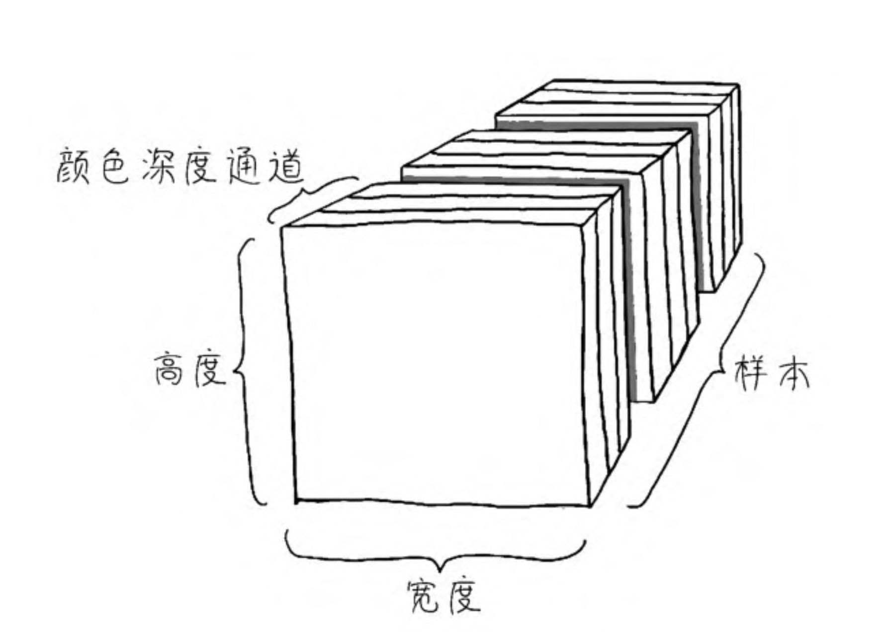  

在机器学习中，不是对上万个数据样本同时进行处理，那样的话机器也受不了，而是一批一批地并行处理，
比如指定批量大小为64。此时每批的100px×100px的彩色图像张量形状为(64， 100，100， 3)，
如果是灰度图像，则为(64，100，100，1)。  

2.4.7 视频数据--5D(阶)张量  
视频可以看作是由一帧一帧的彩色图像组成的数据集。
* 每一帧都保存在一个形状为(高度，宽度，颜色深度)的3D张量中。
* 一系列帧则保存在一个形状为(帧，高度，宽度，颜色深度) 的4D张量中。  
因此，视频数据集需要5D张量才放得下，其形状为(样本，帧，高度，宽度，颜色深度)  


2.5 Python的张量计算     
2.5.1 机器学习中张量创建  
* Pyhton列表的元素在系统内存 中是分散存储的  
* NumPy 数组内 各元素则连续的存储在同一个内存块中，方便元素的遍历，
并可利用现代CPU的向量化计算进行整体并行操作，提升效率。因此NumPy数组要求
元素都具有相同的数据类型，而列表中各元素的类型则可以不同。
* 注意，直接赋值而得来的是Python内置的列表，要用**array方法**转换才能得到NumPy数组  
**注**：在Python中元组(tuple)其中元素不可修改，但list可以
* arange(a，b，c)函数产生a~b(不包括b)，间隔为c的一个数组;而linspace(a，b，c)函数是把a~b(包括b)，平均分成c份。

2.5.2 通过索引和切片访问张量数据  
* 索引(indexing)，就是访问整个数据集张量里面的某个 具体数据
* 切片(slicing)，就是访问一个范围内的数据。  
对多阶张量进行切片，只需要将不同轴上的切片操作用逗号隔开就好了。

2.5.3 张量的整体操作和逐元素运算  
* 张量的算术运算，包括加、减、乘、除、乘方等，既可以整体进行，也可以逐元素进行。
* 也可以对所有元素整体进行函数操作  

2.5.4 张量的变形和转置  
* 张量变形(reshaping)  
* 注意，调用reshape方法时，变形只是暂时的，调用结束后，张量本身并无改变。
如果要彻底地改变张量的形状需要重新赋值

2.5.5 Python中的广播

2.5.6 向量和矩阵的点积运算

2.6 机器学习的几何意义  
2.6.1 机器学习的向量空间  
机器学习模型是在更高维度的几何空间中对特征向量进行操作、变形，计算期间的距离，并寻找从特征向量
到标签之间的函数拟合-这就是从几何角度所阐述的机器学习本质。  

2.6.2 深度学习和数据流形  
深度学习的过程，实际上也就是一个数据提纯的过程。数据从比较粗放的格式，到逐渐变得“计算机友好”。  
数据为什么需要提纯呢?主要还是因为特征维度过高，导致特征空间十分复杂，进而导致机器学习建模过程难度过大。


第3课 线性回归--预测网店的销售额  
一般机器学习的步骤：  
1) 收集数据
2) 数据可视化
3) 特征工程(让数据更容易被机器处理)
4) 拆分数据-训练集、测试集
5) 特征缩放-把数据压缩到比较小的区间
6) 选择机器学习模型：确定机器学习算法、确定假设函数、确定损失函数
7) 通过梯度下降训练机器，确定模型内部参数的过程
8) 进行超参数调整和性能优化

3.2.5 数据集清洗和规范化
* 注意1: 对于回归问题的数值类型数据集，机器学习模型所读入的规范格式应该是2D张量
也就是矩阵，其形状为(样本数，标签数)
* 注意2: 在拆分数据前，要注意数据是否已经被排序或者分类，如果是
还需要先打乱。  

数据归一化公式：x=(x-min(x))/(max(x)-min(x))
* 注：归一化过程中的最大值、最小值，以及最大值和最小值的差，全部来自训练数据集。
**不能使用测试集中的数据信息进行特征缩放中间步骤中任何值计算**

3.3 选择机器学习模型  
3.3.3 损失(误差)函数--L(w,b)  
* 损失(loss): **是对糟糕预测的惩罚**，也就是**误差**，也称为**成本(cost)**或**代价**，
就是当前预测值和真实值之间的差距的体现。它是一个数值，表示对于单个样本而言模型预
测的准确程度。如果模型的预测完全准确，则损失为0；如果不准确，就有损失。
* 注: 针对每一组不同的参数，机器都会针对样本数据集算一次平均损失。
* 损失函数(loss function) L(w,b)就是用来计算平均损失的。也叫**代价函数、成本函数(cost function)**
* 注: 损失函数L是参数w和b的函数，不是针对x的函数。
* 注: **如果平均损失小，参数就好；如果平均损失大，模型或者参数就还要继续调整。**这个计算当前假设函数所造成的损失的过程，
就是前面提到过的**模型内部参数的评估**的过程。

**用于回归的损失函数**
1) 均方误差(Mean Square Error, MSE)函数，也叫平方孙树或L2损失函数
2) 平均绝对误差（Mean Absolute Error，MAE）函数，也叫L1损失函数。
3) 平均偏差误差（mean bias error）函数  

**用于分类的损失函数**
1) 交叉熵损失（cross-entropy loss）函数
2) 多分类SVM损失（hinge loss）函数

**均方误差函数**实现过程
1) 对于每一个样本，其预测值和真实值的差异为（y−y'），而y'=wx+b，所以损失值与参数w和b有关
2) 如果将损失值（y−y'）夸张一下，进行平方（平方之后原来有正 有负的数值就都变成正数），就变成（y−y'）2。我们把这个值叫作单个
样本的平方损失。
3) 需要把所有样本的平方损失都相加，写成求和则为下面的公式

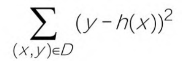  
最后的公式为：
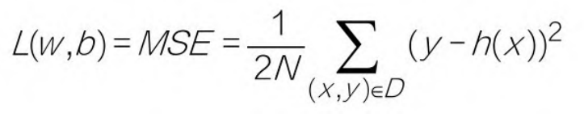  

4) 公式中的N前面还有常量2，是为了在求梯度的时候，抵消二次方后产生的系数，方便后续进行计算，同时增
加的这个常量并不影响梯度下降的最效结果。
5) L: **对于一个给定的训练样本集而言，它是权重w和偏置b的函数，它的大小随着w和b的变化而变。**
6) 使用MSE函数做损失函数的线性回归算法，有时被称为**最小二乘法**

3.4 通过梯度下降找到最佳参数  
3.4.1 训练机器要有正确的方向  

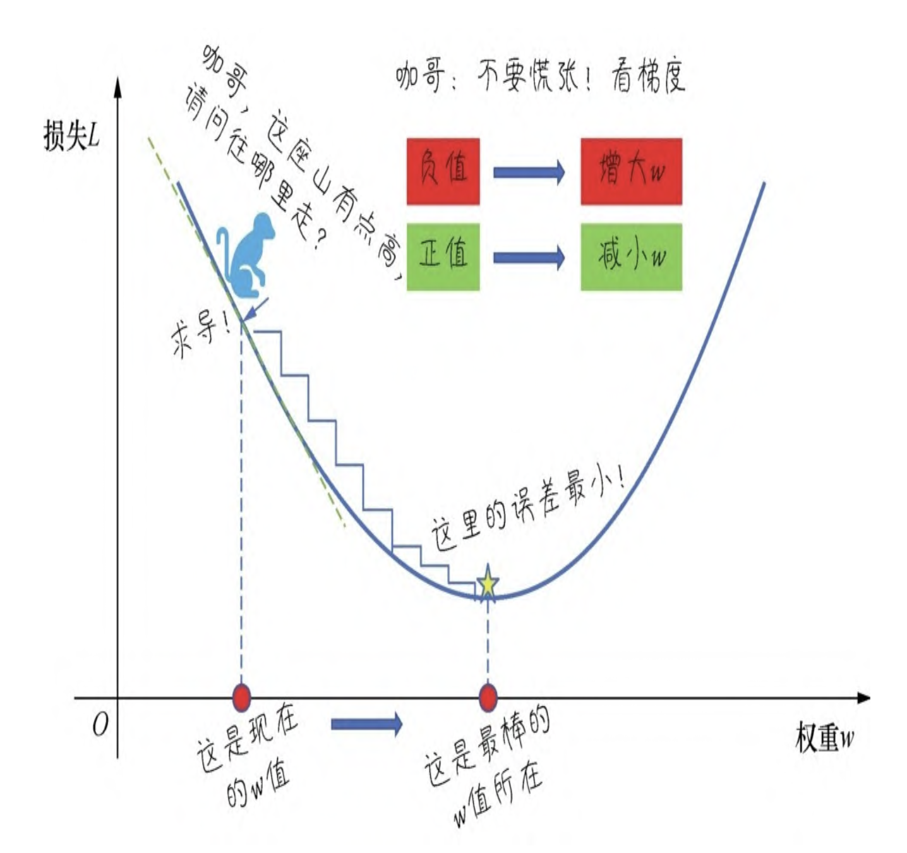 

程序中用梯度下降法通过求导来计算损失曲线在起点处的梯度。此时，就是损失曲线导数的矢量，
它可以让我们了解哪个方向距离目 标“更近”或“更远”。  

* 如果求导后梯度为正值，则说明L正在随着w增大而增大，应该减小w，以得到更小的损失。
* 如果求导后梯度为负值，则说明L正在随着w增大而减小，应该增大w，以得到更小的损失。
* 注:此处在单个权重参数的情况下，损失相对于权重的梯度就称为导数;若考虑偏置，或存在多个权重参数时，
损失相对于单个权重的梯度 就称为偏导数。  

因此，通过对损失曲线进行求导之后，就得到了梯度。梯度具有以下两个特征。
1) 方向:(也就是梯度的正负)
2) 大小:(也就是切线倾斜的幅度)  
这两个重要的特征，尤其是方向特征确保了梯度始终指向损失函数中增长最为迅猛的方向。梯度下降法会沿着
负梯度的方向走一步，以降低损失，如下图:  

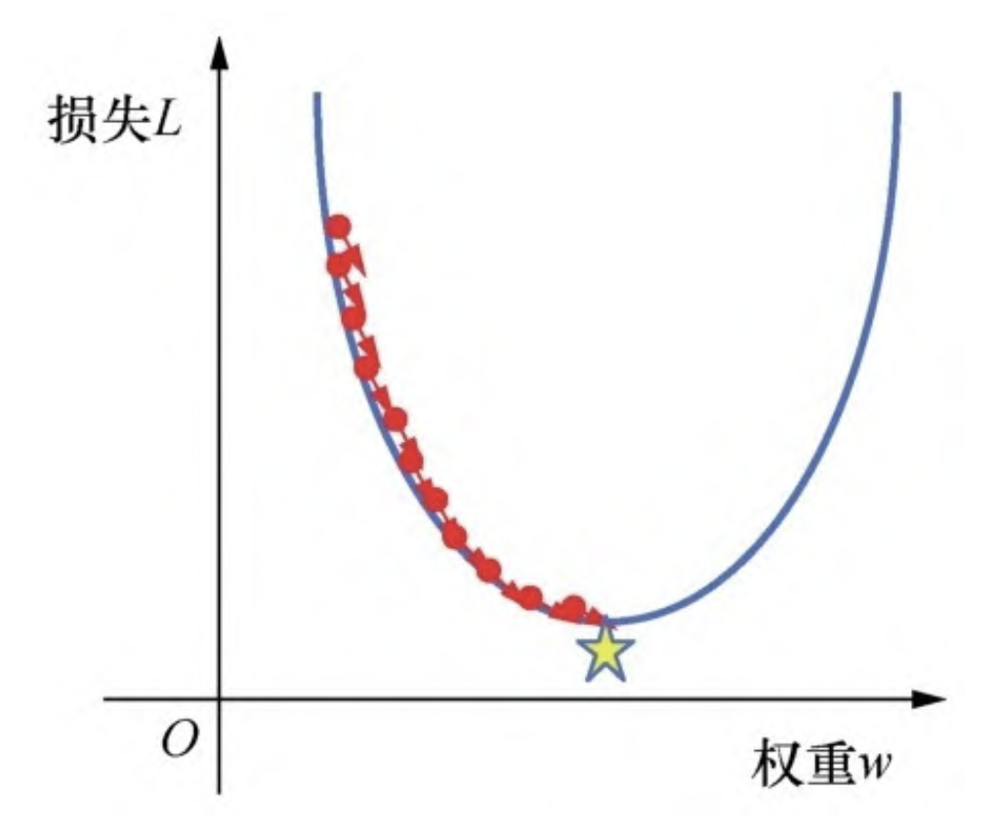 

通过梯度下降法，如果初始估计的值落在最优值左边，那么梯度下降会将w增大，以趋近最低值;
如果初始估计的w值落在最优值右边，那么梯度下降会将w减小，以趋近最低值。
这个逐渐趋近于最优值的过程也叫作损失函数的收敛。

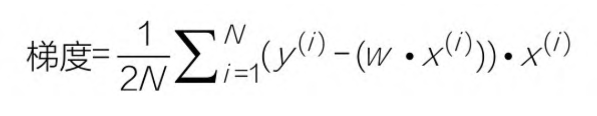 

* 注: 上图有两个错误点：1）2N中的N应该消掉；2）应该是(y_hat - y) 不然的话前面要加负号

3.4.4 学习率也很重要  
* 学习速率(learning rate): 学习速率乘以损失曲线求导之后的微分值，就是一次梯度变化的步长(step size)
它控制着当前梯度下降的节奏，或快或慢, w将在每一次迭代过程中被更新、优化。

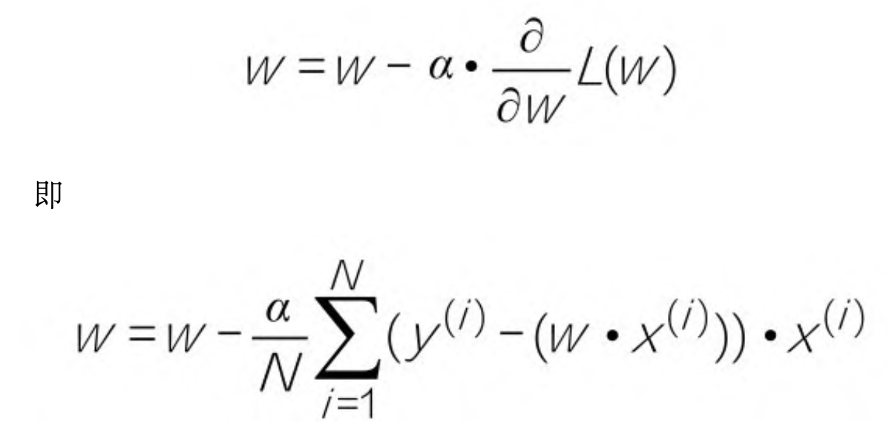 

* 超参数: 像学习速率、迭代次数这样的参数，我们称这类位于模型外部的人工可调节的参数为超参数。
* 模型参数: 而权重 、偏置，当然都是模型内部参数，由梯度下降负责优化，不需要人工调整。

学习率过大过小:

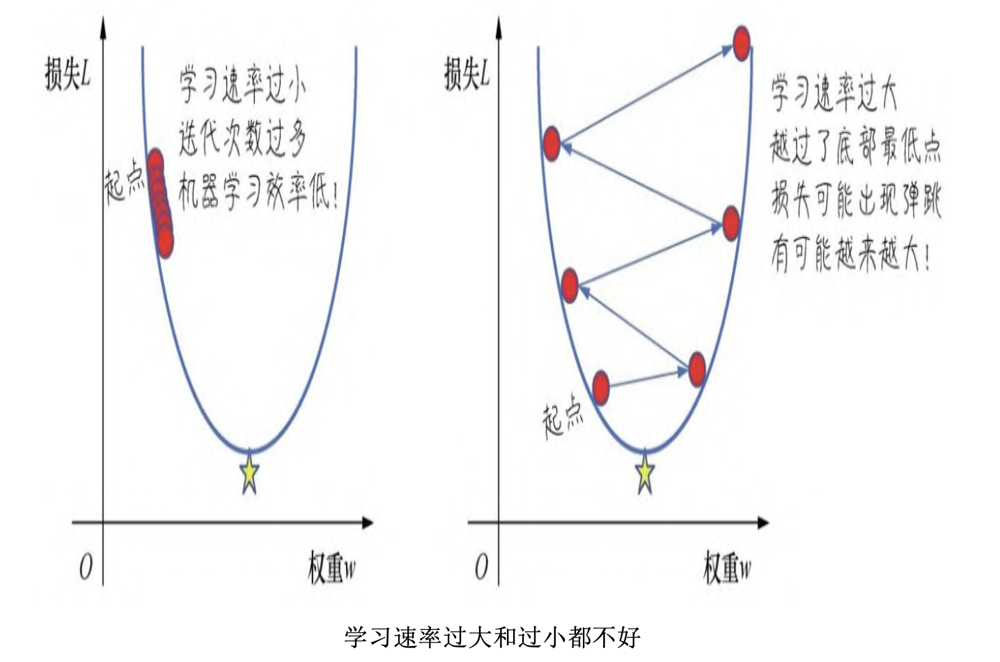 

寻找最佳学习率：一个常见的策略是，在机器学习刚刚开始的时候，学习速率可以设置得大一些，
快速几步达到靠近最佳权重的位置，当逐渐地接近最佳权重时，可以减小学习速率，防止一下子越过最优值。

3.5 实现一元线性回归模型并调试超参数  
3.5.1 权重和偏置的初始值    
3.5.2 进行梯度下降
3.5.3 调试学习速率  
3.5.5 在测试集上进行预测  
测试集损失比训练集损失还低，这种情形并不是机器学习的常态,但在比较小的数据集上是有可能出现的

3.6 实现多元线性回归模型  
多元(变量)的线性方程的假设函数:  

 

其中： 

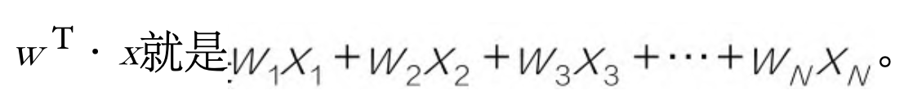 

* 注：如果w是一个向量，x也是一个向量，两个向量做乘法，会得到一个标量，也就是数值y'.
两个向量，你点积我，我点积你，结果是相同的。因此wT·x等于x·wT
* 为什么会有T:因为w和x这两个张量的实际形状为(N，1)的矩阵，它们直接相乘是不行的， 
其中一个需要先转置为(1，N)
1) 张量形状(1，N)点积(N，1)，就得到1×1的标量
2) 张量形状(N，1)点积(1，N)，那就得到(N，N)的矩阵,就不是我们想要的y'。
3) 张量形状(1，N)点积(1，N)，或者(N，1)点积(N，1)，就会出错

还可以把公式进一步简化，就是把b也看作权重w0，那么需要引入x0，这样公式就是:

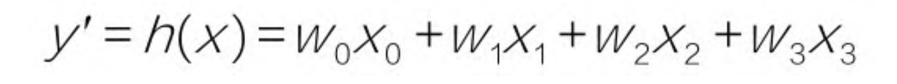 

引入w0，就是给数据集添加一个新的哑(dummy)特征，值为1， 和这个哑特征相乘，值不变:

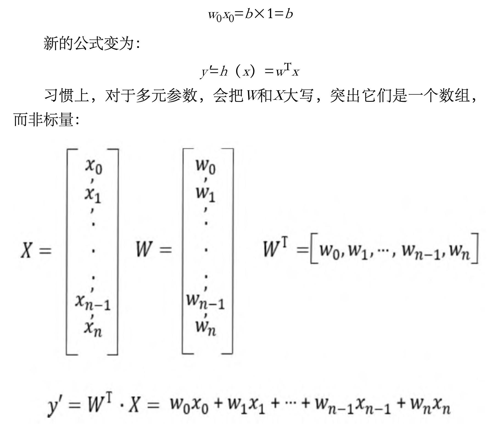 

3.6.2 多变量的损失函数和梯度下降  
损失函数也通过向量化来实现:
```python
def loss_function(X, y, W): # 这个是书上的实现
    y_hat = np.dot(X, W.T)
    y_hat = y_hat.reshape(-1, 1)
    loss = y_hat - y
    cost = np.sum(loss**2)/(2*len(X))
    return cost
```
```python
def loss_function(X, y, weight): # 但更喜欢我自己的，因为我先把weightD变成变成2D，同时还带有T的意味
    y_hat = np.dot(X, weight.reshape(-1,1)) # 点积运算h(x)=w0x0+w1x1+w2x2+w3x3
    loss = y_hat - y # 中间过程, 求 出当前W和真值的差值
    cost = np.sum((loss**2))/(2*len(X)) # 这是平方求和过程, 均方误差函数的代码实现
    return cost
```

权重更新的公式没有变化
 

3.6.4 初始化权重并训练机器

