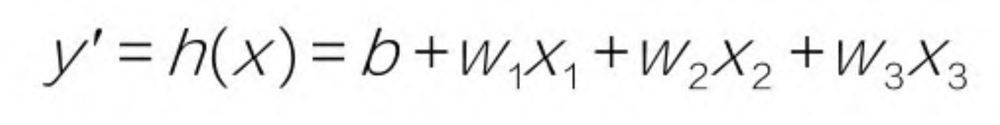
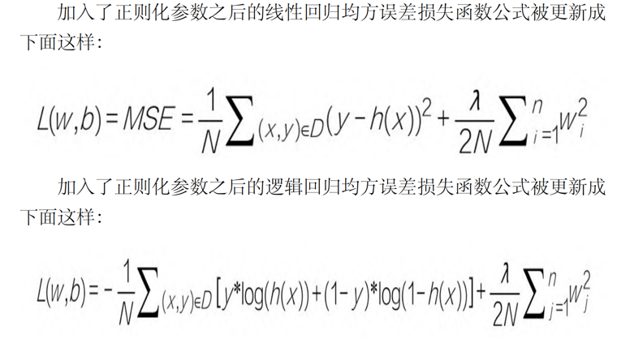

第1课 机器学习快速上手路径--唯有实战  
1.1 机器学习的家族谱  
1.1.2 机器学习就是从数据中发现规律  
什么是机器学习：机器学习关键内涵之一在于计算机的运算能力从大量的数据中发现一个“函数”或“模型”，并通过它来模拟现实世界事物间的关系。

机器学习的另外一个特质是从错误中学习，这一点也与人类的学习方式非常相似

1.1.3 机器学习的类别--监督学习及其他  
监督学习(supervised learning)、无监督学习(unsupervised learning)、半监督学习(semi-supervised learning)。
监督学习的训练需要标签数据，而无监督学习不需要标签数据，半监督学习介于两者之间。

1.1.4 机器学习的重要分支--深度学习  
深度学习采用**神经网络(Artificial Neural Network, ANN)**是数据结构和算法形成的机器学习模型，由大量的所谓人工神经元相互联结而成，这些神经元
都具有可以调整的参数，可以实现监督学习或者无监督学习。

初期的神经网络模型比较简单，后来人们发现网络层数越多，效果越好，就把**层数较多、结构比较复杂
的神经网络机器学习技术叫做深度学习**，神经网络本质上与其他机器学习方法一样，也是统计学方法
的一种应用，只是它结构更深、参数更多。

1.1.6 机器学习的两大应用场景--回归与分类
* 回归(regression): **回归问题**通常用来预测一个值，其**标签**的值是**连续**的。
* 分类(classification): **分类问题**是将事物标记一个类别**标签**，结果为**离散**值，
也就是类别中的一个选项。

1.2 快捷的云实战学习模式  
1.2.3 用Google Colab开发第一个机器学习程序  
Sklearn线性回归模型的score属性给出的是R2分数，它是一个 ，给出的是预测值的方差与总体方 差之间的差异。

1.5 机器学习项目实战架构  
1.5.1 第一个环节：问题定义  
**重要**:在机器学习中，不是一开始就建立模型，而是首先构建你的问题。反复问一问自己、问一问客户
和其他项目干系人，目前的痛点是什么、要解决的问题是什么、目标是什么。--可是在现实中最关键的问题最
可能被忽略。

**如何评判机器学习是否生效**:如果机器学 习无法预测历史，它就无法预测未来。这是因为机器学习只能
识别出 它曾经见过的东西。要想在过去的数据的基础上预测未来，其实存在 一个假设，就是未来的规律与过去相同。


第2课 数学和Python基础知识  
2.1 函数描述了事物间的关系  
2.1.2 机器学习中的函数  
机器学习的目的是进行 预测、判断，实现某种功能。通过学习训练集中的数据，计算机得到 一个从x到y
的拟合结果，也就是函数。然后通过这个函数，计算机就能够从任意的x，推知任意的y。  

无论是传统的机器学习，还是深度学习，所得到的函数模型都是 对样本集中特征到标签的关系的总结，
是其相关性的一种函数化的表达。

2.2 捕捉函数的变化趋势  
2.2.3 凸函数有一个全局最低点  
因为在机器学习的梯度下降过程中，只有凸函数能够确保下降到全局最低点。  

2.3 梯度下降是机器学习的动力之源  
2.3.1 什么是梯度  
* 梯度：两个自变量的函数f(x1，x2)，对应着机器学习数据集中的两个特征，如果分别对x1，x2求偏导数
那么求得的梯度**向量**就是(∂ /∂ 1，∂ /∂ 2)T，在数学上可以表示成Δf( 1， 2)  
* 梯度几何意义：就是函数变化的 方向，而且是变化最快的方向。

2.3.2 梯度下降：下山的隐喻

2.3.3 梯度下降有什么用  
* 机器学习的本质是找到最优的函数
* 如何衡量函数是否最优?其方法是尽量减小预测值和真值间的误差(在机器学习中也叫损失值)
* 可以建立误差和模型参数之间的函数(最好是凸函数)
* 梯度下降能够引导我们走到凸函数的全局最低点，也就是找到误差最小时的参数

2.4 机器学习的数据结构-张量  
2.4.3 向量--1D(阶)张量  
初学者在进行机器学习程序调试过程中，要坚持不懈地输出检查向量的维度，
以及张量的形状。因为一旦维度或张量形状出错了，机器学习建模过程是难以继续的......切记!

注意向量点积的结果是一个值，也就是一个标量，而不是一个向量。

2.4.4 矩阵--2D(阶)张量

2.4.5 序列数据--3D(阶)张量  
机器学习中统一把灰度图像和彩色图像视为4D张量  
序列数据集才是机器学习中的3D张量。而(time series)(简称时序)是最为常见的序列数据集

  

2.4.6 图像数据--4D(阶)张量  
4D张量其形状为(样本，图像高度，图像宽度，颜色深度)  

  

在机器学习中，不是对上万个数据样本同时进行处理，那样的话机器也受不了，而是一批一批地并行处理，
比如指定批量大小为64。此时每批的100px×100px的彩色图像张量形状为(64， 100，100， 3)，
如果是灰度图像，则为(64，100，100，1)。  

2.4.7 视频数据--5D(阶)张量  
视频可以看作是由一帧一帧的彩色图像组成的数据集。
* 每一帧都保存在一个形状为(高度，宽度，颜色深度)的3D张量中。
* 一系列帧则保存在一个形状为(帧，高度，宽度，颜色深度) 的4D张量中。  
因此，视频数据集需要5D张量才放得下，其形状为(样本，帧，高度，宽度，颜色深度)  


2.5 Python的张量计算     
2.5.1 机器学习中张量创建  
* Pyhton列表的元素在系统内存 中是分散存储的  
* NumPy 数组内 各元素则连续的存储在同一个内存块中，方便元素的遍历，
并可利用现代CPU的向量化计算进行整体并行操作，提升效率。因此NumPy数组要求
元素都具有相同的数据类型，而列表中各元素的类型则可以不同。
* 注意，直接赋值而得来的是Python内置的列表，要用**array方法**转换才能得到NumPy数组  
**注**：在Python中元组(tuple)其中元素不可修改，但list可以
* arange(a，b，c)函数产生a~b(不包括b)，间隔为c的一个数组;而linspace(a，b，c)函数是把a~b(包括b)，平均分成c份。

2.5.2 通过索引和切片访问张量数据  
* 索引(indexing)，就是访问整个数据集张量里面的某个 具体数据
* 切片(slicing)，就是访问一个范围内的数据。  
对多阶张量进行切片，只需要将不同轴上的切片操作用逗号隔开就好了。

2.5.3 张量的整体操作和逐元素运算  
* 张量的算术运算，包括加、减、乘、除、乘方等，既可以整体进行，也可以逐元素进行。
* 也可以对所有元素整体进行函数操作  

2.5.4 张量的变形和转置  
* 张量变形(reshaping)  
* 注意，调用reshape方法时，变形只是暂时的，调用结束后，张量本身并无改变。
如果要彻底地改变张量的形状需要重新赋值

2.5.5 Python中的广播

2.5.6 向量和矩阵的点积运算

2.6 机器学习的几何意义  
2.6.1 机器学习的向量空间  
机器学习模型是在更高维度的几何空间中对特征向量进行操作、变形，计算期间的距离，并寻找从特征向量
到标签之间的函数拟合-这就是从几何角度所阐述的机器学习本质。  

2.6.2 深度学习和数据流形  
深度学习的过程，实际上也就是一个数据提纯的过程。数据从比较粗放的格式，到逐渐变得“计算机友好”。  
数据为什么需要提纯呢?主要还是因为特征维度过高，导致特征空间十分复杂，进而导致机器学习建模过程难度过大。


第3课 线性回归--预测网店的销售额  
一般机器学习的步骤：  
1) 收集数据
2) 数据可视化
3) 特征工程(让数据更容易被机器处理)
4) 拆分数据-训练集、测试集
5) 特征缩放-把数据压缩到比较小的区间
6) 选择机器学习模型：确定机器学习算法、确定假设函数、确定损失函数
7) 通过梯度下降训练机器，确定模型内部参数的过程
8) 进行超参数调整和性能优化

3.2.5 数据集清洗和规范化
* 注意1: 对于回归问题的数值类型数据集，机器学习模型所读入的规范格式应该是2D张量
也就是矩阵，其形状为(样本数，标签数)
* 注意2: 在拆分数据前，要注意数据是否已经被排序或者分类，如果是
还需要先打乱。  

数据归一化公式：x=(x-min(x))/(max(x)-min(x))
* 注：归一化过程中的最大值、最小值，以及最大值和最小值的差，全部来自训练数据集。
**不能使用测试集中的数据信息进行特征缩放中间步骤中任何值计算**

3.3 选择机器学习模型  
3.3.3 损失(误差)函数--L(w,b)  
* 损失(loss): **是对糟糕预测的惩罚**，也就是**误差**，也称为**成本(cost)**或**代价**，
就是当前预测值和真实值之间的差距的体现。它是一个数值，表示对于单个样本而言模型预
测的准确程度。如果模型的预测完全准确，则损失为0；如果不准确，就有损失。
* 注: 针对每一组不同的参数，机器都会针对样本数据集算一次平均损失。
* 损失函数(loss function) L(w,b)就是用来计算平均损失的。也叫**代价函数、成本函数(cost function)**
* 注: 损失函数L是参数w和b的函数，不是针对x的函数。
* 注: **如果平均损失小，参数就好；如果平均损失大，模型或者参数就还要继续调整。**这个计算当前假设函数所造成的损失的过程，
就是前面提到过的**模型内部参数的评估**的过程。

**用于回归的损失函数**
1) 均方误差(Mean Square Error, MSE)函数，也叫平方孙树或L2损失函数
2) 平均绝对误差（Mean Absolute Error，MAE）函数，也叫L1损失函数。
3) 平均偏差误差（mean bias error）函数  

**用于分类的损失函数**
1) 交叉熵损失（cross-entropy loss）函数
2) 多分类SVM损失（hinge loss）函数

**均方误差函数**实现过程
1) 对于每一个样本，其预测值和真实值的差异为（y−y'），而y'=wx+b，所以损失值与参数w和b有关
2) 如果将损失值（y−y'）夸张一下，进行平方（平方之后原来有正 有负的数值就都变成正数），就变成（y−y'）2。我们把这个值叫作单个
样本的平方损失。
3) 需要把所有样本的平方损失都相加，写成求和则为下面的公式

  
最后的公式为：
  

4) 公式中的N前面还有常量2，是为了在求梯度的时候，抵消二次方后产生的系数，方便后续进行计算，同时增
加的这个常量并不影响梯度下降的最效结果。
5) L: **对于一个给定的训练样本集而言，它是权重w和偏置b的函数，它的大小随着w和b的变化而变。**
6) 使用MSE函数做损失函数的线性回归算法，有时被称为**最小二乘法**

3.4 通过梯度下降找到最佳参数  
3.4.1 训练机器要有正确的方向  

 

程序中用梯度下降法通过求导来计算损失曲线在起点处的梯度。此时，就是损失曲线导数的矢量，
它可以让我们了解哪个方向距离目 标“更近”或“更远”。  

* 如果求导后梯度为正值，则说明L正在随着w增大而增大，应该减小w，以得到更小的损失。
* 如果求导后梯度为负值，则说明L正在随着w增大而减小，应该增大w，以得到更小的损失。
* 注:此处在单个权重参数的情况下，损失相对于权重的梯度就称为导数;若考虑偏置，或存在多个权重参数时，
损失相对于单个权重的梯度 就称为偏导数。  

因此，通过对损失曲线进行求导之后，就得到了梯度。梯度具有以下两个特征。
1) 方向:(也就是梯度的正负)
2) 大小:(也就是切线倾斜的幅度)  
这两个重要的特征，尤其是方向特征确保了梯度始终指向损失函数中增长最为迅猛的方向。梯度下降法会沿着
负梯度的方向走一步，以降低损失，如下图:  

 

通过梯度下降法，如果初始估计的值落在最优值左边，那么梯度下降会将w增大，以趋近最低值;
如果初始估计的w值落在最优值右边，那么梯度下降会将w减小，以趋近最低值。
这个逐渐趋近于最优值的过程也叫作损失函数的收敛。

 

* 注: 上图有两个错误点：1）2N中的N应该消掉；2）应该是(y_hat - y) 不然的话前面要加负号

3.4.4 学习率也很重要  
* 学习速率(learning rate): 学习速率乘以损失曲线求导之后的微分值，就是一次梯度变化的步长(step size)
它控制着当前梯度下降的节奏，或快或慢, w将在每一次迭代过程中被更新、优化。

 

* 超参数: 像学习速率、迭代次数这样的参数，我们称这类位于模型外部的人工可调节的参数为超参数。
* 模型参数: 而权重 、偏置，当然都是模型内部参数，由梯度下降负责优化，不需要人工调整。

学习率过大过小:

 

寻找最佳学习率：一个常见的策略是，在机器学习刚刚开始的时候，学习速率可以设置得大一些，
快速几步达到靠近最佳权重的位置，当逐渐地接近最佳权重时，可以减小学习速率，防止一下子越过最优值。

3.5 实现一元线性回归模型并调试超参数  
3.5.1 权重和偏置的初始值    
3.5.2 进行梯度下降
3.5.3 调试学习速率  
3.5.5 在测试集上进行预测  
测试集损失比训练集损失还低，这种情形并不是机器学习的常态,但在比较小的数据集上是有可能出现的

3.6 实现多元线性回归模型  
多元(变量)的线性方程的假设函数:  

 

其中： 

 

* 注：如果w是一个向量，x也是一个向量，两个向量做乘法，会得到一个标量，也就是数值y'.
两个向量，你点积我，我点积你，结果是相同的。因此wT·x等于x·wT
* 为什么会有T:因为w和x这两个张量的实际形状为(N，1)的矩阵，它们直接相乘是不行的， 
其中一个需要先转置为(1，N)
1) 张量形状(1，N)点积(N，1)，就得到1×1的标量
2) 张量形状(N，1)点积(1，N)，那就得到(N，N)的矩阵,就不是我们想要的y'。
3) 张量形状(1，N)点积(1，N)，或者(N，1)点积(N，1)，就会出错

还可以把公式进一步简化，就是把b也看作权重w0，那么需要引入x0，这样公式就是:

 

引入w0，就是给数据集添加一个新的哑(dummy)特征，值为1， 和这个哑特征相乘，值不变:

 

3.6.2 多变量的损失函数和梯度下降  
损失函数也通过向量化来实现:
```python
def loss_function(X, y, W): # 这个是书上的实现
    y_hat = np.dot(X, W.T)
    y_hat = y_hat.reshape(-1, 1)
    loss = y_hat - y
    cost = np.sum(loss**2)/(2*len(X))
    return cost
```
```python
def loss_function(X, y, weight): # 但更喜欢我自己的，因为我先把weightD变成变成2D，同时还带有T的意味
    y_hat = np.dot(X, weight.reshape(-1,1)) # 点积运算h(x)=w0x0+w1x1+w2x2+w3x3
    loss = y_hat - y # 中间过程, 求 出当前W和真值的差值
    cost = np.sum((loss**2))/(2*len(X)) # 这是平方求和过程, 均方误差函数的代码实现
    return cost
```

权重更新的公式没有变化
 

3.6.4 初始化权重并训练机器


第4课 逻辑回归--给病患和鸢尾花分类  
4.1 问题定义：判断客户是否患病  
**机器学习的一大优势，就是可以对我们本身并不是特别理解的数据，也产生精准的洞见**  
4.2 从回归问题到分类问题  
4.2.1 机器学习中的分类问题  
机器学习的分类方法，找到一个合适额函数，拟合输入和输出关系，输入一个或一系列事物的特征
输出这个事物的类别  
输入特征_通过函数输出类别  

 

* 注：机器不能够识别“男”，”女“，只能识别"1" "2"。这种文本到数值的转换是必做的特征工程  
而输出则是离散的数值，如0,1,2,3等分别对应不同的类别。  
这些类别之间是互斥关系，如一个动物是狗就不能是猫  
* 注：算法首先输出的其实是一个**可能性，可以把这个可能性理解成一个概率**
1) 机器学习模型根据输入判断一个人患心脏病的可能性为80%，那么就把这个人判定为”患病“类，输出数值1.
2) 机器学习模型根据输入判断一个人患心脏病的可能性为30%，那么判定这个人为”健康“，输出数值0
* 机器学习的分类过程，也就是确定某一事物隶属于某一个类型的**可能性大小**的过程

4.2.2 用线性回归+阶跃函数完成分类
* 注：对于分类编码为0、1的标签，一般分类阈值取0.5；如果分类编码为-1、+1，则分类阈值取0.  
通过这个阈值把回归的连续性结果转换成了分类的阶跃性、离散性的结果。

 

这个同学考了0分不要紧，但是因为数据集的样本数量本来就不 多，一个离群的样本会造成线性回归
模型发生改变。为了减小平均误差，回归线现在要往0分那边稍作移动。因此，概率0.5这个阈值点所
对应的x分数也发生了移动，目前变成了50分。这样，如果有一个同学考了51分，本来是没有及格，
却被这个模型判断为及格（通过考试的概率高于0.5）。这个结果与我们的直觉不符。
* 注：放在这是想说明，离群样本对模型的影响，可能这就是要对特征数据做标准化，归一化的原因之一吧

4.2.3 通过Sigmoid函数进行转换  
因为这个函数对于靠近0分和100分附近的极端样本是很不敏感的，类似样本的分类概率将无限逼近0或1，
样本个数再多也无所谓。但是在0.5这个分类概率临界点附近的样本将对函数的形状产生较大的影响。
也就是说，样本越靠近分类阈值，函数对它们就越敏感。

 

* 逻辑函数(logistic function)在机器学习中，logistic function被广泛应用于逻辑回归分类和
神经网络激活过程。  

 

* 注:为什么这里自变量的符号用的是z而不是x？因为它是一个中间变量，代表的是线性回归的结果。
而这里g（z）输出的结果是一个0～1的数字，也代表着分类概率。
* 通过Sigmoid函数就能够比阶跃函数更好地把线性函数求出的数值，
转换为一个0～1的分类概率值。

* Sigmoid 代码实现
```python
y_hat = 1/(1+ np.exp(-z)) # 输入中间变量z, 返回y'
```

4.2.4 逻辑回归的假设函数  
1) 首先通过线性回归模型求出一个中间值z，z=w0x1+w1x1+…+wnxn+b=WTX。它是一个连续值， 
区间并不在［0，1］之间，可能小于0或者大于1，范围从无穷小到无穷大。
2) 然后通过逻辑函数把这个中间值z转化成0～1的概率值，以提高拟合效果$g(z) = \frac{1}{1 + e^{-x}}$
3) 结合步骤（1）和（2），把新的函数表示为假设函数的形式:
$$h(x) = \frac{1}{1 + e^{-(w^T x)}}$$
4) 最后还要根据y'所代表的概率，确定分类结果
* 如果h（x）值大于等于0.5，分类结果为1
* 如果h（x）值小于0.5，分类结果为0

 

综上，逻辑回归所做的事情，就是把线性回归输出的任意值，通过数学上的转换，输出为0～1的结果，
以体现二元分类的概率（严格来说为后验概率）。

* 上述过程中的关键在于选择Sigmoid函数进行从线性回归到逻辑回归的转换。

Sigmoid函数的优点如下
1) Sigmoid函数是连续函数，具有单调递增性（类似于递增的线性函数）
2) Sigmoid函数具有可微性，可以进行微分，也可以进行求导
3) 输出范围为［0，1］，结果可以表示为概率的形式，为分类输出做准备。
4) 抑制分类的两边，对中间区域的细微变化敏感，这对分类结果拟合效果好。

4.2.5 逻辑回归的损失函数  
在逻辑回归中，不能使用MSE。因为经过了一个逻辑函数的转换之后，MSE对于w和b而言，不再是一个凸函数，
这样的话，就无法通过梯度下降找到全局最低点，如下图所示。

 

为了避免陷入局部最低点，我们为逻辑回归选择了符合条件的新的损失函数，公式如下

 

这是一个函数在真值为0或者1的时候的两种情况:

 

* 如果真值是1，但假设函数预测概率接近于0的话，得到的损失值将是巨大的。
* 如果真值是0，但假设函数预测概率接近于1的话，同样将得到天价的损失值。

 

这个公式其实等价于上面的损失函数在0、1时的两种情况，同学们可以自己代入y = 0和y = 1
两种取值分别推演一下。

代码实现:
```python
loss = - (y_train*np.log(y_hat) + (1-y_train)*np.log(1- y_hat))
```

4.2.6 逻辑回归的梯度下降
我们所选择的损失函数经过Sigmoid变换之后是可微的，也就是说每一个点都可以求导，
而且它是凸函数，存在全局最低点。梯度下降的目的就是把w和b调整、再调整，直至最低的损失点。  

逻辑回归的梯度下降过程和线性回归一样，也是先进行微分，然后把计算出来的导数乘以一个学习速率α，
通过不断的迭代，更新w和b，直至收敛。

逻辑回归的梯度计算公式如下：
 

 

 

代码实现:
```python
def loss_function(X, y, w, b): # 注 为了与X进行矩阵点积操作，把W直接构建成2D矩阵
    y_hat = sigmoid(np.dot(X, w) + b) # Sigmoid逻辑函数 + 线性函数(wX +b) 得到y_hat 
    # 那么点积之后生成的y_hat，就是一个形状为（242，1）的张量，其中存储了每一个样本的预测值。
    loss = - (y*np.log(y_hat) + (1-y)*np.log(1 - y_hat)) # 计算损失
    #   语句loss = -((y*np.log(y_hat) + (1-y)*np.log(1-y_hat))计算了每一个
    # 样本的预测值y'到真值y的误差，其中用到了Python的广播功能，比如1-y
    # 中的标量1就被广播为形状（242，1）的张量。
    cost = np.sum(loss)/X.shape[0] # 整个数据集的平均损失
    # 语句cost = np.sum（loss） / X.shape［0］是将所有样本的误差
    # 取平均值，其中X.shape［0］就是样本个数，cost，英文意思是成本，也
    # 就是数据集中各样本的平均损失。
    return cost # 返回整个数据集的平均损失

# 逻辑回归的梯度下降过程
def gradient_descent(X, y, w, b, lr, iter): # 定义逻辑回归梯度下降
    l_history = np.zeros(iter)
    w_history = np.zeros((iter, w.shape[0], w.shape[1]))
    b_history = np.zeros(iter)
    for i in range(iter):
        y_hat = sigmoid(np.dot(X, w) + b) # sigmoid函数 + 线性函数(wX +b)得到y_hat
        loss = -(y*np.log(y_hat) + (1-y)*np.log(1-y_hat)) # 计算损失
        d_w = np.dot(X.T, (y_hat - y))/X.shape[0]
        d_b = np.sum(y_hat - y)/X.shape[0]
        w = w - lr*d_w
        b = b - lr*d_b
        l_history[i] = loss_function(X,y,w,b)
        print('轮次', i+1, '当前训练集损失: ', l_history[i])
        w_history[i] = w # 注意w_history和w的形状
        b_history[i] = b
    return l_history, w_history, b_history
```

4.3 通过逻辑回归解决二元分类问题
4.3.1 数据的准备与分析  
* 注：首先查看标签数据，因为如果某一类别比例特别低（例如300个数据中只有3个人患病），
那么这样的数据集直接通过逻辑回归的方法做分类可能是不适宜的。

* 注: 在有些数据集中，MinMaxScaler()进行的数据特征缩放不仅不会提高效率，
似乎还会令预测准确率下降。**这个结果提示我们：没有绝对正确的理论，实践才是检验真理的唯一标准。**

4.3.2 建立逻辑回归
* 注：# 还要注意权重的梯度是一个形状为（13，1）的张量，其维度和特征轴维度相同，
而偏置的梯度则是一个值。
* 注：w_history是一个3D张量，因为w已经是一个2D张量了，因此语句w_history［i］ = w，
就是把权重赋值给w_history的后两个轴。而w_history的第一个轴则是迭代次数轴。

4.3.3 开始训练机器
* 注：**一定要注意梯度方法里面的(y_hat - y) 如果是 （y - y_hat）则更新的时候 w = w - lr*d_w
,bias 更新也是**

* 注：**经过线性函数及Sigmoid函数出来的是一个概率，一定要根据阈值把它转换成你的目标，如0,1**

4.3.5 绘制损失曲线  

4.3.6 直接调用Sklearn
4.3.7 哑特征的使用  
* 如果原始数据，例如男、女这种字符，首先转换成0、1数据格式。
* heart数据集中的cp,thal,slope这样的数据类型，也代表列别，如cp(胸痛)，取值为0,1,2,3。这些分类
是与大小无关的。计算机会把它们理解为数值，认为3比2大，2比1大。这种把“胸痛类型”的类别
像“胸部大小”的尺码一样去解读是不科学的，会导致误判。因为这种类别值只是一个代号，它的意义和
年龄、身高这种连续数值的意义不同。解决的方法，是把这种**类别特征拆分成多个哑特征**，比如cp有0、
1、2、3这4类，就拆分成个4特征，cp_0为一个特征、cp_1为一个特征、cp_2为一个特征、cp_3为一个特征。
每一个特征都还原成二元分类，答案是Yes或者No，也就是数值1或0。
* 哑变量用以反映质的属性的一个人工变量，是量化了的质变量，通常取值为0或1。

4.4 问题定义：确定鸢尾花的种类
4.5 从二元分类到多元分类  
1) 二元分类的思路：：通过逻辑回归算法确定一个种类或者一种情况出现的概率。
2) 多元分类：就是多个类别，而且每一个类别和其他类别都是互斥的情况。

4.5.2 多元分类的损失函数  
多元分类的标签共有以下两种格式
* one-hot格式的分类编码，比如，数字0～9分类中的数字8，格式为［0，0，0， 0，0，0，0，1，0］。
* 直接转换为类别数字，如1、2、3、4。
* 如果通过one-hot分类编码输出标签，则应使用分类交叉熵（categorical crossentropy）作为损失函数。
* 如果输出的标签编码为类别数字，则应使用稀疏分类交叉熵（sparse categorical crossentropy）作为损失函数。

4.6 正则化、欠拟合和过拟合  
4.6.1 **正则化（regularization）**
* 规范化(normalization): 一般是把数据限定在需要的范围，比如[0，1],从而消除了数据量纲对建模的影响。
* 标准化(standardization): 化一般是指将数据正态分布，使平均值为0，标准差为1  
**它们都是针对数据做手脚，消除过大的数值差异，以及离群数据所带来的偏见。经过规范化和标准化的数据，
能加快训练速度，促进算法的收敛。”**
* 正则化: **正则化不是对数据的操作,机器学习中的正则化是在损失函数里面加惩罚项，
增加建模的模糊性，从而把捕捉到的趋势从局部细微趋势，调整到整体大概趋势。虽然一定程度上地放宽了建模
要求，但是能有效防止过拟合的问题，增加模型准确性。它影响的是模
型的权重。**

4.6.2 欠拟合和过拟合  
正则化技术所要解决的过拟合问题，连同欠拟合（underfit）一起，都是机器学习模型调优（找最佳模型）、
参数调试（找模型中的最佳参数）过程中的主要阻碍。

 

项目初期会倾向于用比较简单的函数模型去拟合训练数据集，比如线性函数（上图第1个）。  
后来发现简单的函数模型不如复杂一点的模型拟合效果好，所以调整模型之后，有可能会得到
更小的均方误差（上图第2个）。  
如果继续追求更完美的效果，甚至接近于0的损失，可能会得到类似于上图第3个函数图形。

**模型好不好，不能单看训练集上的损失。或者说，不能主要看训练集上
的损失，更重要的是看测试集上的损失。**

 

一开始模型“很烂”的时候，训练集和测试集的误差都
很大，这是**欠拟合**。随着模型的优化，训练集和测试集的误差都有所下
降，其中训练集的误差值要比测试集的低。这很好理解，因为函数是根
据训练集拟合的，泛化到测试集之后表现会稍弱一点。但是，如果此处
继续增加模型对训练集的拟合程度，会发现测试集的误差将逐渐升高。
这个过程就被称作**过拟合**。

* 注: 模型的复杂度可以代表迭代次数的增加（内部参数的
优化），也可以代表模型的优化（特征数量的增多、函数复杂度的提高，比如从线性函数到二次、
多次函数，或者说决策树的深度增加，等等）。
* 过拟合就是机器学习的模型过于依附于训练集的特征，因而
模型泛化能力降低的体现。**泛化**能力，就是模型从训练集移植到其他数
据集仍然能够成功预测的能力。
* 分类问题也会出现过拟合，如下图所示，过于细致的分类边界也造
成了过拟合。

 

**过拟合现象是机器学习过程中怎么甩都甩不掉的阴影**，影响着模
型的泛化功能，因此我们几乎在每一次机器学习实战中都要和它作战！

降低过拟合现象通常有以下几种方法:
1) 增加数据集的数据个数。数据量太小时，非常容易过拟合，因为
小数据集很容易精确拟合。
2) 找到模型优化时的平衡点，比如，选择迭代次数，或者选择相对
简单的模型。
3) **正则化**为可能出现过拟合现象的模型增加正则项，通过降低模
型在训练集上的精度来提高其泛化能力，这是非常重要的机器学习思想
之一

4.6.3 正则化参数
机器学习中的正则化通过引入模型参数λ（lambda）来实现

 

* 注：上图中的逻辑回归的损失函数应该是交叉熵损失函数

现在的训练优化算法是一个由两项内容组成的函数：一个是**损失
项**，用于衡量模型与数据的拟合度；另一个是**正则化项**，用于调解模型
的复杂度。

**正则化机制引入损失函数之后，当权重大的时候，损失被加大，λ值越大，惩罚越大。这
个公式引导着机器在进行拟合的时候不会随便增加权重。**

记住，正则化的目的是帮助我们减少过拟合的现象，而它的本质是
约束（限制）要优化的参数。  
其实，正则化的本质，就是**崇尚简单化**。同时以最小化损失和复杂
度为目标，这称为**结构风险最小化**。

**奥卡姆剃刀定律**认为科学家应该优先采用更简单的公式或
理论。将该理论应用于机器学习，就意味着越简单的模型，有可能具有
越强的泛化能力。

选择λ值的目标是在简单化和训练集数据拟合之间达到适当的平
衡。

* 如果λ值过大，则模型会非常简单，将面临数据欠拟合的风险。
此时模型无法从训练数据中获得足够的信息来做出有用的预测。而且λ
值越大，机器收敛越慢。
* 如果λ值过小，则模型会比较复杂，将面临数据过拟合的风险。
此时模型由于获得了过多训练数据特点方面的信息而无法泛化到新数
据。
* 将λ设为0可彻底取消正则化。在这种情况下，训练的唯一目的是
最小化损失，此时过拟合的风险较高。  
正则化参数通常有L1正则化和L2正则化两种选择。
* L1正则化，根据权重的绝对值的总和来惩罚权重。在依赖稀疏特
征（后面会讲什么是稀疏特征）的模型中，L1正则化有助于使不相关或
几乎不相关的特征的权重正好为0，从而将这些特征从模型中移除。
* L2正则化，根据权重的平方和来惩罚权重。L2 正则化有助于使
离群值（具有较大正值或较小负值）的权重接近于0，但又不会正好为
0。在线性模型中，L2 正则化比较常用，而且在任何情况下都能够起到
增强泛化能力的目的。

刚才给出的正则化公式实际上是L2正则化，因为权重w正则化时做了平方。

正则化不仅可以应用于逻辑回归模型，也可以应用于线性回归和其
他机器学习模型。应用L1正则化的回归又叫Lasso Regression（套索回
归），应用L2正则化的回归又叫Ridge Regression（岭回归）。  
而最佳λ值则取决于具体数据集，需要手动或自动进行调整。

4.7 通过逻辑回归解决多元分类问题  
4.7.1 数据的准备与分析    
4.7.2 通过Sklearn实现逻辑回归的多元分类  
```python
lr = LogisticRegression(penalty='l2', C = 0.1) # 设定L2正则化和C参数
```
* L2正则化，只是选择了正则化的参数类别，但是用多大的力度进行呢？C表示正则化的
力度，它与λ刚好成反比。C值越小，正则化的力度越大。

* Scikit-learn中的C参数与λ成反比关系，$\lambda = \frac{1}{C}$

4.7.3 正则化参数--C值的选择  
不同C值对分类精度的影响  

 

 

1) C取值越大，分类精度越大。注意，当C=1 000时图中左下方
的圆点，本来按照其特征空间的位置来说，应该被放弃纳入圆点类，但
是算法因为正则化的力度过小，过分追求训练集精度而将其划至山鸢尾
集（圆点类），导致算法在这里过拟合。
2) 当C值取值过小时，正则化的力度过大，为了追求泛化效
果，算法可能会失去区分度。

还可以绘制出测试精度随着C参数的不同取值而变化的学习曲线
（learning curve），这样，可以更清晰地看到C值是如何
影响训练集以及测试集的精度的。

如何选择C值  
1) 一个因素是应该观察比较高的测试集准确率
2) 另一个因素是训练集和测试集的准确率之差比较小，通常会
暗示更强的泛化能力。


